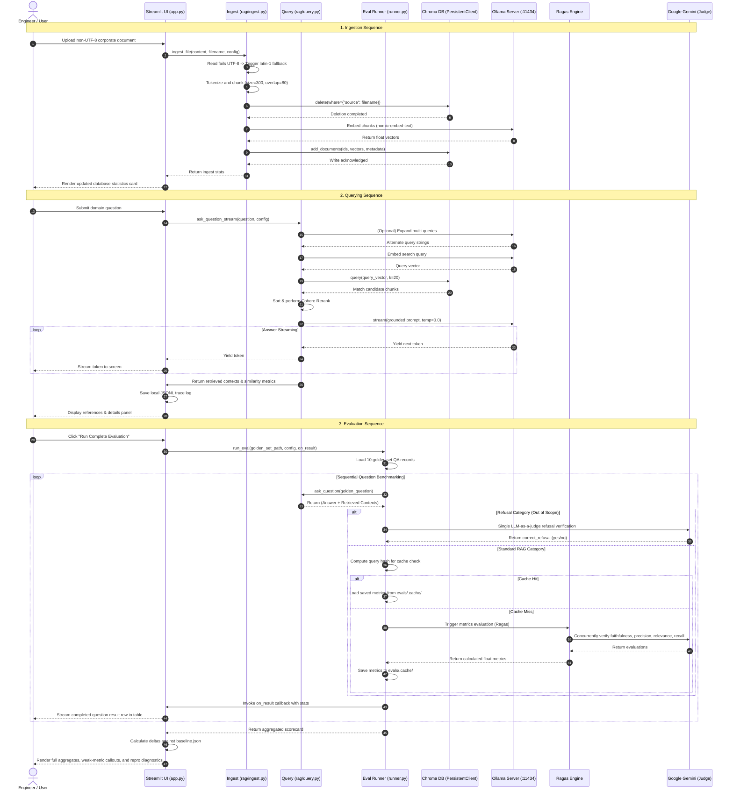

# Technical Specification — Stage 3: End-to-End Production RAG System with Quantitative Evaluation (Ragas)

**Working Name:** Local Private RAG with Ragas Evaluation Suite  
**Status:** Approved · **Date:** 2026-07-22  
**Version:** 3.0 · **Author:** Claude Code (Official Anthropic CLI Agent)

---

## 1. System Architecture Overview

The system is a production-hardened, privacy-first, local Retrieval-Augmented Generation (RAG) application with an integrated **Quantitative Evaluation Suite**. It operates as two distinct, co-dependent pipelines: the **Operations Pipeline** (responsible for ingestion, adaptive retrieval, multi-query expansion, reranking, and traced generation) and the **Evaluation Pipeline** (responsible for assessing pipeline performance against a 10-question golden dataset using Ragas LLM-as-a-judge and custom refusal metrics).

```
                                  +---------------------------------------+
                                  |             USER BROWSER              |
                                  +---+-------------------------------+---+
                                      |                               ^
                       File Uploads,  | (WebSocket Connection)        | Streamed Responses,
                       Configs & Run  |                               | Scorecards & Deltas
                       Commands       v                               |
                                  +---+-------------------------------+---+
                                  |         STREAMLIT DASHBOARD (app.py)  |
                                  +---+-------------------------------+---+
                                      |                               |
                     (Internal Calls) |                               | (Internal API Call)
                                      v                               v
                       +--------------+------------+   +--------------+------------+
                       |    OPERATIONS PIPELINE    |   |    EVALUATION PIPELINE    |
                       |       (rag/query.py)      |   |     (evals/runner.py)     |
                       +--------------+------------+   +--------------+------------+
                                      |                               |
                     Get Chunks,      |                               | Evaluates Runs via
                     Rerank & Gen     v                               | LLM-as-a-judge
                       +--------------+------------+                  |
                       |       OLLAMA ENGINE       |                  |
                       |  - llama3.2:3b            |                  |
                       |  - nomic-embed-text       |                  |
                       +--------------+------------+                  v
                                      |                +--------------+------------+
                       SQLite Cosine  |                |     GOOGLE GEMINI API     |
                       Read / Write   v                |   (gemini-2.5-flash-lite) |
                       +--------------+------------+   +---------------------------+
                       | CHROMA DB PERSISTENT VDB  |
                       |   Collection: "docs"      |
                       +---------------------------+
```

### 1.1 Tech Stack & Dependency Pinning
The system enforces exact dependency locking in the python environment to guarantee evaluation consistency across CLI and UI executions.

*   **User Interface:** Streamlit (v1.59.2) - Native reactive streaming dashboard.
*   **Orchestration:** LangChain (v1.3.14) with:
    *   `langchain-ollama` (v1.1.0) - Local embeddings & Chat generation.
    *   `langchain-chroma` (v1.1.0) - Persistent Vector store integration.
    *   `langchain-text-splitters` (v1.1.2) - Document structural chunking.
    *   `langchain-google-genai` (v4.2.7) - Google Gemini integrations.
*   **Vector Database:** Chroma DB (v1.5.9) - Embedded persistent client with Cosine metric space.
*   **Local Inference Engine:** Ollama Server (v0.1.x+) - Hosts local models on Port 11434.
    *   *Embedding Model:* `nomic-embed-text` (768 dims).
    *   *Chat LLM:* `llama3.2:3b` (3 Billion parameters).
*   **External Rerank Engine:** Cohere Rerank API (v3.5) utilizing `rerank-v3.5`.
*   **Evaluation Engine:** Ragas (v0.4.3) - Industry standard RAG metrics library.
*   **Judge Model:** Google Gemini (v2.12.1 SDK) utilizing `gemini-2.5-flash-lite` (free-tier).

---

## 2. Ingestion & Operations Pipeline

The Operations Pipeline manages document parsing, vector indexing, query handling, and grounded retrieval.

### 2.1 Robust Document Ingestion (`rag/ingest.py`)
Document processing supports `.txt`, `.md`, and `.pdf` files.
*   **Loader Fallback:** Implements a robust double-decoding architecture. When loading raw files, the system defaults to `UTF-8`. On encountering `UnicodeDecodeError`, it falls back to `latin-1` to prevent ingestion failures with proprietary, non-UTF-8, or legacy documents.
*   **Text Splitter Defaults:** Utilizes `RecursiveCharacterTextSplitter` configured for high granularity:
    *   `chunk_size`: **300** characters.
    *   `chunk_overlap`: **80** characters.
*   **Replace Semantics:** Generates unique content hashes `sha256(content)[:12]`. Chunk IDs are formatted as `f"{file_hash}:{chunk_index}"`. Prior to write operations, previous document chunks are purged via Chroma's metadata filters: `where={"source": filename}`.
*   **Task Prefixing:** Nomics's embedding model requires context-specific prefixes:
    *   *Ingested Chunk:* Saved as `f"search_document: {chunk_text}"`. The raw text is saved in metadata as `original_text` to maintain clean presentation inside UI components.

### 2.2 Advanced Querying & Retrieval (`rag/query.py`)
Queries are processed through a multi-stage retrieval routine:
1.  **Multi-Query Expansion:** Generates alternative phrasings using the query LLM to overcome lexical limitations of similarity search.
2.  **Adaptive Similarity Retrieval:** Queries are prepended with `search_query: ` and embedded with `nomic-embed-text`. Chunks are retrieved from Chroma based on Cosine similarity:
    $$S_c = \max(0.0, \min(1.0, 1.0 - d))$$
3.  **Reranking:** Ranks retrieved chunks using Cohere's `rerank-v3.5` API or on-device `cross-encoder/ms-marco-MiniLM-L-6-v2` to filter out background noise and sort chunks by direct semantic relevance.
4.  **Deterministic Generation:** Feeds the highest-scoring contexts to `llama3.2:3b` at `temperature = 0.0`. Prompt templates in `rag/prompts.py` mandate strict adherence to retrieved text and inline citations (`[filename]`). If the context is empty or irrelevant, the model must decline with: *"I can't find that in the ingested documents."*
5.  **Decision Tracing (`rag/tracing.py`):** Captures metadata, prompt configurations, intermediate search results, similarity scores, and final responses. Traces are stored in a rolling local JSONL file under `traces/YYYY-MM-DD.jsonl` (limited to the last 200 traces).

---

## 3. Quantitative Evaluation Pipeline (`evals/runner.py`)

The Evaluation Pipeline provides programmatically isolated, headless benchmarking. It scores the active RAG configuration against a committed reference dataset.

```
       +--------------------------------------------------------+
       |                  evals/golden_set.json                 |
       |  - 10 fixed questions (4 Single Fact, 2 Multi-hop,     |
       |    1 Aggregation, 2 Out of Scope, 1 Ambiguous)         |
       +---------------------------+----------------------------+
                                   |
                                   v
       +--------------------------------------------------------+
       |                  evals/runner.py                       |
       |  - Sequential pipeline run over questions              |
       |  - Yields (Query + Answer + Chunks)                    |
       +---------------------------+----------------------------+
                                   |
                                   | Check Cache
                                   v
              +--------------------+--------------------+
              |               Is SHA-256 Hit?           |
              +---------+---------------------+---------+
                        | Yes                 | No
                        v                     v
          +-------------+-------------+ +-----+-----------------+
          |      Return Cached        | |   Make Live Judge     |
          |      Metric Scores        | |     Calls (Gemini)    |
          +---------------------------+ +-----+-----------------+
                                              |
                                              v
                                        +-----+-----------------+
                                        |  Store in Local Cache |
                                        |     evals/.cache/     |
                                        +-----------------------+
```

### 3.1 The Golden Dataset (`evals/golden_set.json`)
Consists of exactly 10 questions crafted directly from the reference corpus, establishing an absolute baseline.
*   **Categories:**
    *   `single_fact` (4 questions): Targeted factual lookup.
    *   `multi_hop` (2 questions): Connects information across multiple chunks.
    *   `aggregation` (1 question): Summarizes/gathers points.
    *   `out_of_scope` (2 questions): Excluded from documents. Correct expected behavior is to **refuse**.
    *   `ambiguous` (1 question): Unclear context requiring targeted handling.

### 3.2 Evaluation Metrics & LLM-as-a-Judge
For operational evaluation, the pipeline computes four distinct Ragas metrics + a custom Refusal Accuracy score:

1.  **Faithfulness:** Assesses if the generated response relies *only* on retrieved contexts (detects hallucinations).
2.  **Answer Relevancy:** Assesses if the generated response directly addresses the query without redundancy.
3.  **Context Precision:** Assesses if the correct information chunks are ranked higher during similarity search.
4.  **Context Recall:** Assesses if all the required reference ground-truth information was successfully retrieved.
5.  **Refusal Accuracy (Custom):** For questions where `expected_behavior: "refuse"`, Ragas metrics are skipped. Instead, a dedicated single judge call is executed:
    > *"Does this response decline to answer the question? Answer yes or no."*
    A boolean `correct_refusal` is calculated and refusal performance is scored separately to avoid corrupting standard RAG metric averages.

### 3.3 Concurrency, Rate Limiting, & Resiliency
*   **Concurrency:** Runs evaluation calls concurrently using Python's ThreadPool Executor with a bounded semaphore of size 4 (default).
*   **Resiliency:** Judge calls targeting `gemini-2.5-flash-lite` are protected by a exponential backoff + random jitter routine to gracefully handle HTTP 429 (Rate Limits) and 5xx network errors.
*   **Caching Layer:** Eliminates duplicate API charges. Keys are computed via SHA-256 hashes of execution parameters:
    $$\text{Cache Key} = \text{SHA256}(\text{Question} \parallel \text{Contexts} \parallel \text{Answer} \parallel \text{Metric Name} \parallel \text{Judge Model} \parallel \text{Ragas Version})$$
    Scores are persisted in JSON format under `evals/.cache/`. A pipeline run with zero code/context modifications registers a 100% cache-hit rate and resolves in under 1 second.

---

## 4. UI Dashboard & Diagnostics Matrix

The fourth view (**📊 Evaluate Pipeline**) introduces real-time streaming, baseline comparisons, and diagnostic suggestions.

### 4.1 UI Design & Streaming Mechanics
*   **Asynchronous Streaming:** Utilizing an `on_result(qid, question_res)` callback, each evaluated row is streamed to the screen dynamically. The UI displays active timers, a numeric completed tracker, and progress bars instead of blocking the user interface.
*   **Baseline Delta Comparisons:** On run completion, if `baseline.json` is detected under `evals/scorecards/`, the UI calculates and displays metric deltas ($\pm\Delta$) with visual up/down arrows to illustrate performance improvements or regressions.
*   **Question Drill-Down:** Clicking an individual question displays detailed debug data including the actual answer, retrieved chunks, reference ground truth, metrics breakdown, and Ragas' per-claim reasoning.

### 4.2 Verbatim Diagnostics Matrix
To guide system optimizations, the UI calculates the weakest overall aggregate metric and maps it to specific system levers:

| Weakest Metric | Likely Root Cause | Practical System Levers |
|---|---|---|
| **Context Recall** | The right information never made it into the top-K retrieved chunks | Adjust Chunk Size/Overlap, change embedding models, increase retrieval parameter K, implement query rewriting |
| **Context Precision** | Relevant context is present but crowded by unrelated noise | Integrate a semantic reranker, lower retrieval parameter K, apply metadata filters |
| **Faithfulness** | The generator is inventing claims beyond the provided context | Tighten grounding instructions, mandate inline citations, reduce model temperature, swap to a larger LLM |
| **Answer Relevance** | The answer is factually correct but misses the core question | Structural prompt adjustments, enforce question restatement, apply answer-format constraints |

---

## 5. End-to-End System Diagrams

### 5.1 E2E Operational vs. Evaluation Flowchart
The following diagram traces the system's operational workflow and shows how the evaluation suite interfaces with the active RAG pipelines.

```mermaid
flowchart TD
    %% Styling
    classDef ingest fill:#e1f5fe,stroke:#01579b,stroke-width:2px;
    classDef query fill:#efebe9,stroke:#3e2723,stroke-width:2px;
    classDef eval fill:#efe8my,stroke:#2e7d32,stroke-width:2px;
    classDef storage fill:#fff3e0,stroke:#e65100,stroke-width:2px;
    
    %% Operational Ingestion
    subgraph Ingest_Pipeline [Document Ingest]
        A[Upload Doc] --> B{UTF-8 Read?}
        B -- No --> C[latin-1 Fallback Read]
        B -- Yes --> D[Raw Document String]
        C --> D
        D --> E[Text Splitting: 300, 80]
        E --> F[Generate ID SHA-256 Hash]
        F --> G[Query & Purge Old Chunks]
        G --> H[Prepend search_document prefix]
        H --> I[(Embed & Save in ChromaDB)]
    end
    
    %% Operational Querying
    subgraph Query_Pipeline [Query Resolver]
        J[User Question] --> K{Multi-Query Trigger?}
        K -- Yes --> L[Generate Alternate Questions]
        K -- No --> M[Grounded Query]
        L --> M
        M --> N[Prepend search_query prefix]
        N --> O[(Chroma Similarity Search)]
        O --> P[Convert Cosine Distance to Score]
        P --> Q[Sort and Cohere Rerank v3.5]
        Q --> R[Assemble Context Prompt]
        R --> S[Stream llama3.2:3b Gen temp=0.0]
        S --> T[Write Local JSONL Decision Trace]
    end
    
    %% Evaluation Pipeline
    subgraph Eval_Pipeline [Evaluation Suite]
        U[Trigger Evaluation] --> V[Load Golden Set]
        V --> W[Loop through 10 Questions]
        W --> X[Execute Query Pipeline]
        X --> Y{Refusal Question?}
        Y -- Yes --> Z[Single Judge Call: correct_refusal]
        Y -- No --> AA{Cache hit?}
        AA -- Yes --> AB[Fetch Saved Metric Scores]
        AA -- No --> AC[Ragas LLM-as-a-judge: Gemini]
        AC --> AD[Compute aggregate scores]
        AB --> AD
        Z --> AD
        AD --> AE[Stream Progress to Dashboard]
        AE --> AF[Save Scorecard / Update Baseline]
    end

    class A,B,C,D,E,F,G,H,I ingest;
    class J,K,L,M,N,O,P,Q,R,S,T query;
    class U,V,W,X,Y,Z,AA,AB,AC,AD,AE,AF eval;
    class I,O,T storage;
```



---

### 5.2 E2E System Interaction Sequence
This diagram details the chronological communication flow across all RAG subsystems during a complete execution cycle.



---

### 5.4 Configuration Specifications
System properties managed via `config.yaml` or `evals/config.yaml`:

| Context / Category | Configuration Key | Default Value | Acceptable Range | Engineering Impact |
|---|---|---|---|---|
| **RAG Parameters** | `chunk_size` | `300` | `200 - 2000` | Controls chunk granularity during parsing |
| **RAG Parameters** | `chunk_overlap` | `80` | `0 - 400` | Preserves cross-chunk textual context |
| **RAG Parameters** | `top_k` | `3` | `1 - 10` | Final chunks sent to local generator LLM |
| **RAG Parameters** | `candidate_k` | `20` | `5 - 50` | Candidate pool sent to semantic reranker |
| **Eval Parameters** | `judge_model` | `gemini-2.5-flash-lite` | Supported Google models | LLM-as-a-judge evaluation cost and quality |
| **Eval Parameters** | `concurrency_limit` | `4` | `1 - 10` | Bounded semaphore rate limit safety margin |
| **Eval Parameters** | `request_timeout` | `30` | `5 - 120` | Prevents evaluation hang on network drops |
| **Eval Parameters** | `cache_dir` | `evals/.cache` | Valid system path | Target folder for saved evaluation cache |
| **Eval Parameters** | `scorecard_dir` | `evals/scorecards` | Valid system path | Target folder for saved scorecard runs |
| **Thresholds** | `faithfulness` | `0.8` | `0.0 - 1.0` | Minimal acceptable hallucination score |
| **Thresholds** | `answer_relevancy`| `0.8` | `0.0 - 1.0` | Minimal acceptable question-answering target |
| **Thresholds** | `context_precision`| `0.8` | `0.0 - 1.0` | Minimal acceptable search ranking target |
| **Thresholds** | `context_recall` | `0.8` | `0.0 - 1.0` | Minimal acceptable document search coverage |